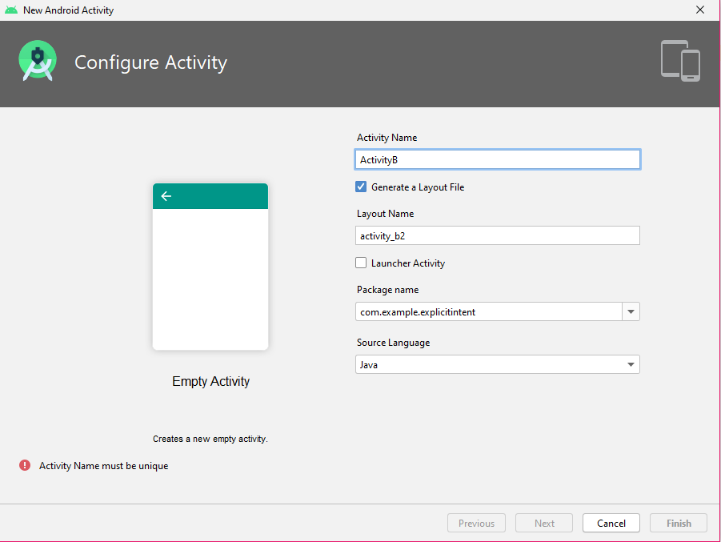
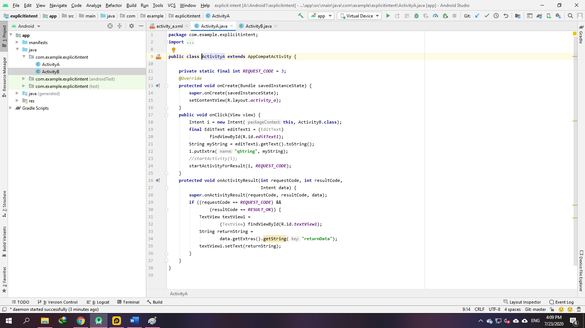
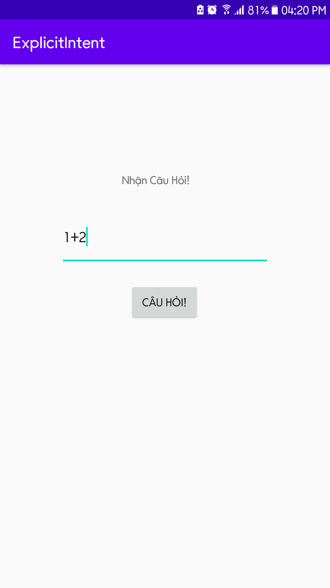

### ĐỐI TƯỢNG INTENT TRONG ANDROID (Phần 1)

- <a href= "https://ngocminhtran.com/2018/11/05/doi-tuong-intent-trong-android-phan-1/"> Ứng Dụng Từ Bài</a>

### Yêu Cầu
A. MÔ TẢ VỀ Android Studio:

### Intent
- Intent là cơ chế cho phép các Activity có thể giao tiếp với nhau. Có hai dạng intent là intent tường minh (explicit intent) và intent ngầm định (implicit intent). Trong bài này chúng ta sẽ khám phá kiểu Intent tường minh.

- Intent tường minh (explicit intent)
- Giao tiếp giữa các Activity
- Intent là cơ chế cho phép giao tiếp giữa các Activity và giả sử ActivityA muốn giao tiếp với ActivityB. Intent tường minh yêu cầu chúng ta phải xác định rõ Activity (ActivityB) mà Activity hiện tại (ActivityA) muốn giao tiếp. Cách sử dụng intent tường minh rất phổ biến khi chúng ta cần thực hiện giao tiếp giữa các Activity trong cùng một ứng dụng. 
- Đoạn mã sau minh họa cách giao tiếp với ActivityB thông qua intent:
- Đầu tiên chúng ta phải tạo một thể hiện (i) của lớp Intent với hai tham số là context của Activity hiện tại muốn giao tiếp với ActivityB (mặc định là this). - 
- Kế tiếp chúng ta sẽ thực thi giao tiếp với phương thức startActivity với đối số là thể hiện của Intent vừa tạo (i).

### Trả về dữ liệu đến một Activity
- Như trên đã đề cập, ActivityA có thể giao tiếp và gửi dữ liệu đến ActivityB thông qua Intent và ActivityB có thể nhận dữ liệu từ ActivityA thông qua một đối tượng trung gian gọi là Bundle. Tuy nhiên, một câu hỏi được đặt ra là ActivityB có thể gửi dữ liệu trở lại ActivityA hay không? Câu trả lời là có thể nếu chúng ta xem ActivityB là một Activity con (sub-Activity) của ActivityA. Điều này có thể đạt được bằng cách gọi phương thức startActivtiyForResult() thay vì gọi phương thức startActivity():
startActivityForResult(i, REQUEST_CODE);
- Tham số REQUEST_CODE là giá trị được dùng để xác định dữ liệu trả về ActivityA.
- ActivityB (lúc này được xem là Activity con của ActivityA) muốn trả về dữ liệu đến ActivityA phải thực hiện phương thức finish(). Mục đích của việc gọi finish() nhằm tạo một đối tượng Intent mới chứa dữ liệu trả về và gọi phương thức setResult() với các tham số là RESULT_OK nếu trả về thành công hay RESULT_CANCEL nếu trả về thất bại và đối tượng Intent vừa tạo:

- Ứng dụng minh họa với Intent tường minh và quá trình giao tiếp giữa các activities
- Tạo ActivityA
- Tạo một ứng dụng mới tên ExplicitIntent, nhập ngocminhtran.com trong Company Domain, chọn Phone and Tablet và API 14, chọn Empty Activity và nhập tên ActivityA trong Activity Name và activity_a trong Layout Name.
- Mở tập tin activity_a.xml trong chế độ Design, xóa TextView “Hello World!” mặc định, thêm một TextView, một EditText (Plain Text), và một Button với giá trị thuộc tính ID và Text lần lượt là:

### Tạo ActivityB
- Tìm đến gói com.ngocminhtran.explicitintent trong thư mục app > java và nhấn chuột phải vào gói này chọn New > Activity > Empty Activity:

### Tạo Thêm ActivityA và ActivityB xong chúng ta thực hiện chạy giả lập.

- Nhập Giá trị or tên lên trên TextView.
- Sẽ hiện ra kết quả sau khi ta ấn Button

- Sau nhập TextView ấn Button sẽ ngược lại

### Lời kết
- Trong bài này chúng ta đã tìm hiểu kiểu Intent tường minh và đã thực hiện tạo một ứng dụng minh họa dùng Intent này. Source code đầy đủ các tập tin của ứng dụng ExplicitIntent

### Chúc Các Bạn Thành Công !!!

### Bạn Có Thể Xem Bài Tiếp Theo:

- <a href="https://github.com/ChanhMinions/ImplicitIntent2">ĐỐI TƯỢNG INTENT TRONG ANDROID (Phần 2)!</a>

                                                             Trần Phú , Ngày 23 tháng 7 Năm 2020

